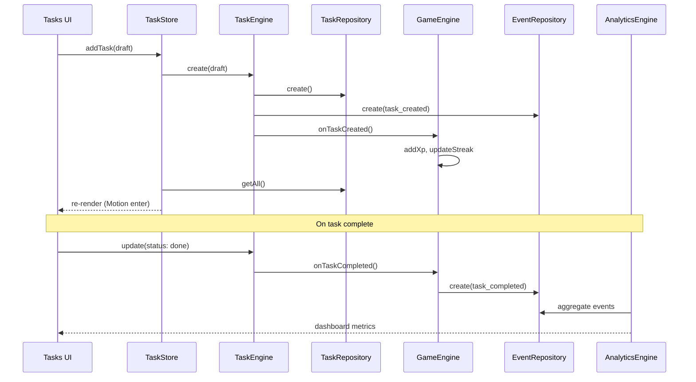

# Sequence Diagrams

## Task creation → Snapshot → XP → Analytics

```mermaid
sequenceDiagram
  participant UI as Tasks UI
  participant Store as TaskStore
  participant TE as TaskEngine
  participant Repo as TaskRepository
  participant GE as GameEngine
  participant ER as EventRepository
  participant AE as AnalyticsEngine

  UI->>Store: addTask(draft)
  Store->>TE: create(draft)
  TE->>Repo: create()
  TE->>ER: create(task_created)
  TE->>GE: onTaskCreated()
  GE->>GE: addXp, updateStreak
  Store->>Repo: getAll()
  Store-->>UI: re-render (Motion enter)

  Note over UI,AE: On task complete
  UI->>TE: update(status: done)
  TE->>GE: onTaskCompleted()
  GE->>ER: create(task_completed)
  AE->>ER: aggregate events
  AE-->>UI: dashboard metrics
```
